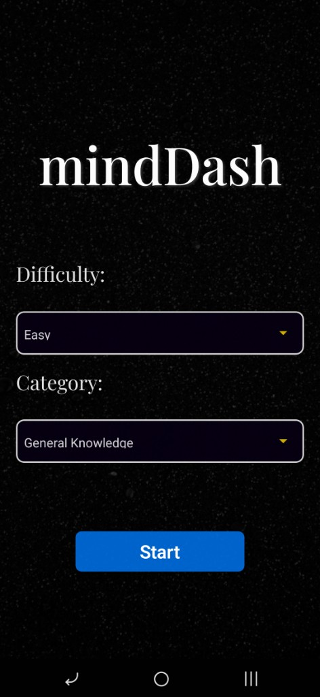
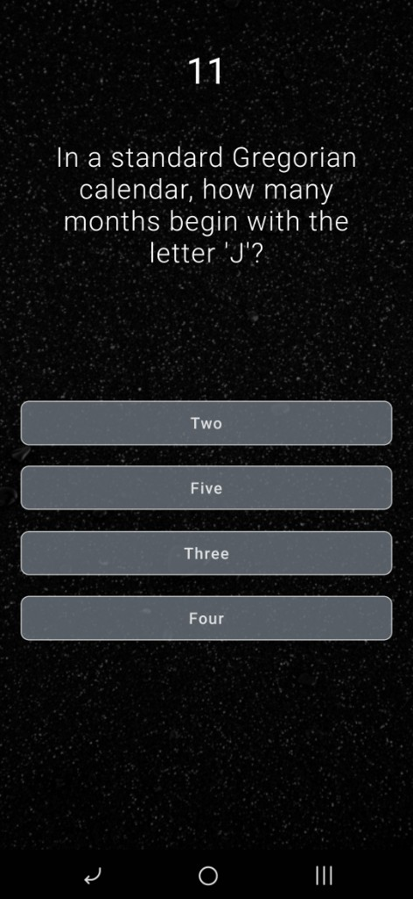
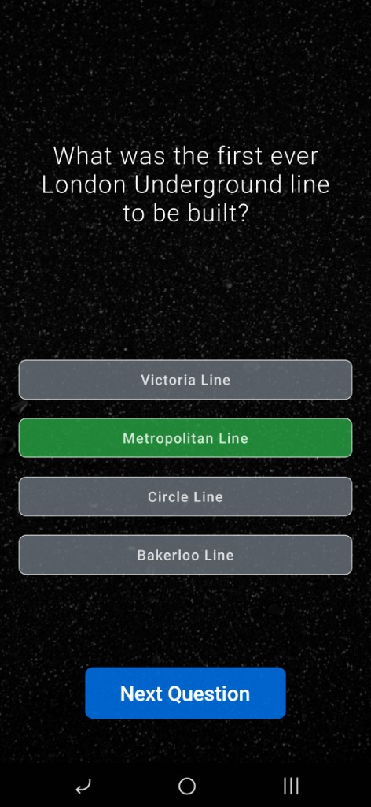
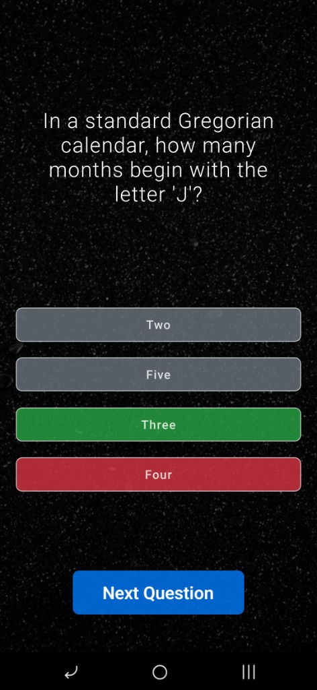
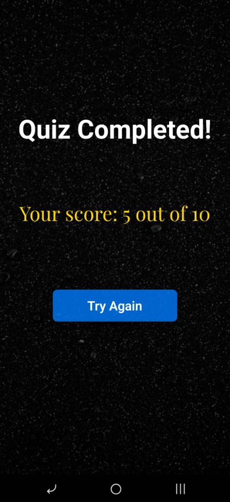

# MindDash 🧠

A beautiful and engaging trivia quiz application built with React Native for Android. Test your knowledge across multiple categories and difficulty levels with timed questions and immersive sound effects.

## Table of Contents

- [About](#about)
- [Features](#features)
- [Screenshots](#screenshots)
- [Tech Stack](#tech-stack)
- [Project Structure](#project-structure)
- [Installation](#installation)
- [Running the App](#running-the-app)
- [Building for Production](#building-for-production)
- [API Reference](#api-reference)
- [How to Play](#how-to-play)
- [License](#license)

## About

MindDash is a mobile trivia game that challenges players with questions from various categories. The app fetches real-time questions from the Open Trivia Database, ensuring a fresh experience every time you play. With its elegant dark theme, smooth animations, and audio feedback, MindDash provides an engaging quiz experience.

### Purpose

- Provide an entertaining way to test and expand general knowledge
- Offer customizable quiz experiences with multiple difficulty levels
- Create an immersive gaming experience with sound and visual feedback
- Challenge users with timed questions to add excitement

## Features

### Core Features

| Feature | Description |
|---------|-------------|
| **Multiple Categories** | Choose from 20+ trivia categories including Science, History, Sports, Entertainment, and more |
| **Three Difficulty Levels** | Easy, Medium, and Hard modes to match your skill level |
| **Timed Questions** | 15-second countdown timer for each question adds challenge |
| **Score Tracking** | Track your performance with real-time score updates |
| **Instant Feedback** | Visual indicators show correct (green) and incorrect (red) answers |

### UI/UX Features

| Feature | Description |
|---------|-------------|
| **Animated Splash Screen** | Beautiful Lottie animation while the app loads |
| **Pulsing Start Button** | Animated button that draws attention |
| **Custom Typography** | Elegant Playfair Display font throughout the app |
| **Dark Theme** | Eye-friendly dark interface with semi-transparent overlays |
| **Background Images** | Visually appealing background imagery |

### Audio Features

| Feature | Description |
|---------|-------------|
| **Background Music** | Ambient music plays during the quiz |
| **Click Sounds** | Audio feedback for button interactions |
| **Correct Answer Sound** | Celebratory sound for right answers |
| **Wrong Answer Sound** | Distinct sound for incorrect answers |

## Screenshots

<div align="center">

### Start Page
Select your difficulty level and quiz category before starting.



### Quiz Question
Answer questions within the 15-second timer.



### Correct Answer
Correct answers are highlighted in green.



### Wrong Answer
Wrong answers show in red, with the correct answer revealed in green.



### Quiz Completed
View your final score and play again.



</div>

## Tech Stack

| Technology | Version | Purpose |
|------------|---------|---------|
| React Native | 0.76.6 | Mobile app framework |
| React | 18.2.0 | UI library |
| React Navigation | 6.x | Screen navigation |
| Lottie React Native | 7.3.8 | Splash screen animation |
| React Native Sound | 0.11.2 | Audio playback |
| React Native Picker | 2.11.4 | Dropdown selectors |

## Project Structure

```
mindDash/
├── android/                    # Android native code
│   ├── app/
│   │   ├── src/main/
│   │   │   ├── assets/fonts/   # Custom fonts (Playfair Display)
│   │   │   ├── res/raw/        # Sound files (mp3)
│   │   │   └── res/mipmap-*/   # App icons
│   │   └── build.gradle        # Android build config
│   └── gradle.properties       # Gradle settings
├── ios/                        # iOS native code (not configured)
├── assets/
│   ├── 1.jpg                   # Background image
│   └── loading.json            # Lottie animation file
├── components/
│   ├── StartPage.js            # Home screen with settings
│   └── QuizPage.js             # Quiz gameplay screen
├── screenshots/                # App screenshots for documentation
├── utils/
│   └── htmlEntities.js         # HTML entity decoder utility
├── App.js                      # Main app component
├── index.js                    # App entry point
├── package.json                # Dependencies
└── README.md                   # This file
```

## Installation

### Prerequisites

- Node.js >= 18
- npm or yarn
- Android Studio with SDK
- Java Development Kit (JDK) 17
- Android Emulator or physical device

### Steps

1. **Clone the repository**
   ```bash
   git clone https://github.com/Adrianlov/mindDash.git
   cd mindDash
   ```

2. **Install dependencies**
   ```bash
   npm install
   ```

3. **Install Android dependencies**
   ```bash
   cd android
   ./gradlew clean
   cd ..
   ```

## Running the App

### Start Metro Bundler
```bash
npm start
```

### Run on Android
```bash
npm run android
```

Or run directly:
```bash
npx react-native run-android
```

### Run on Emulator
Make sure your Android emulator is running, then execute the run command above.

## Building for Production

### Generate Release AAB (for Google Play)

1. **Ensure you have a release keystore** (keep it secure and backed up)

2. **Build the release bundle**
   ```bash
   cd android
   ./gradlew bundleRelease
   ```

3. **Find the AAB file**
   ```
   android/app/build/outputs/bundle/release/app-release.aab
   ```

### Generate Release APK

```bash
cd android
./gradlew assembleRelease
```

The APK will be at: `android/app/build/outputs/apk/release/app-release.apk`

## API Reference

MindDash uses the [Open Trivia Database API](https://opentdb.com/):

### Endpoints Used

| Endpoint | Purpose |
|----------|---------|
| `https://opentdb.com/api_category.php` | Fetch available categories |
| `https://opentdb.com/api.php?amount=10&category={id}&difficulty={level}` | Fetch quiz questions |

### Response Format

Questions include:
- Question text (HTML encoded)
- Correct answer
- Incorrect answers (3 options)
- Category and difficulty metadata

## How to Play

### Getting Started

1. **Launch the app** - Wait for the splash screen animation to complete
2. **Select difficulty** - Choose Easy, Medium, or Hard from the dropdown
3. **Select category** - Pick a trivia category that interests you
4. **Press Start** - Tap the pulsing "Start" button to begin

### During the Quiz

1. **Read the question** - Questions appear in the center of the screen
2. **Watch the timer** - You have 15 seconds to answer each question
3. **Select an answer** - Tap one of the four answer buttons
4. **View feedback** - Correct answers turn green, wrong answers turn red
5. **Continue** - Press "Next Question" to proceed

### Buttons Reference

| Button | Location | Action |
|--------|----------|--------|
| **Start** | Start Page | Begins the quiz with selected settings |
| **Answer Options** | Quiz Page | Select your answer (4 choices) |
| **Next Question** | Quiz Page | Move to the next question (appears after answering) |
| **Try Again** | Results Screen | Return to Start Page for a new quiz |

### Scoring

- Each correct answer = 1 point
- No penalty for wrong answers or timeout
- Final score displayed as "X out of 10"

### Tips

- Read questions carefully before the timer runs out
- If unsure, make an educated guess rather than timing out
- Try different categories to discover your strengths
- Increase difficulty as you improve

## Sound Files

The app includes the following audio files located in `android/app/src/main/res/raw/`:

| File | Purpose |
|------|---------|
| `background.mp3` | Ambient music during quiz |
| `click.mp3` | Button tap feedback |
| `correct.mp3` | Correct answer celebration |
| `wrong.mp3` | Incorrect answer indicator |

## Contributing

Contributions are welcome! Please feel free to submit a Pull Request.

## License

This project is private and for personal use.

---

**Built with React Native**

*Happy Quizzing!*
